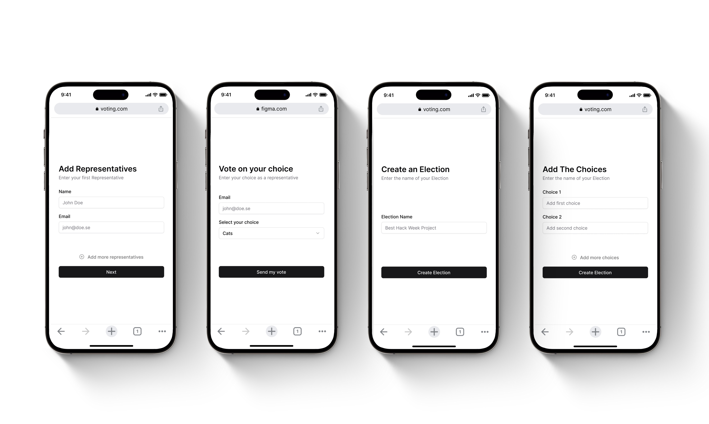
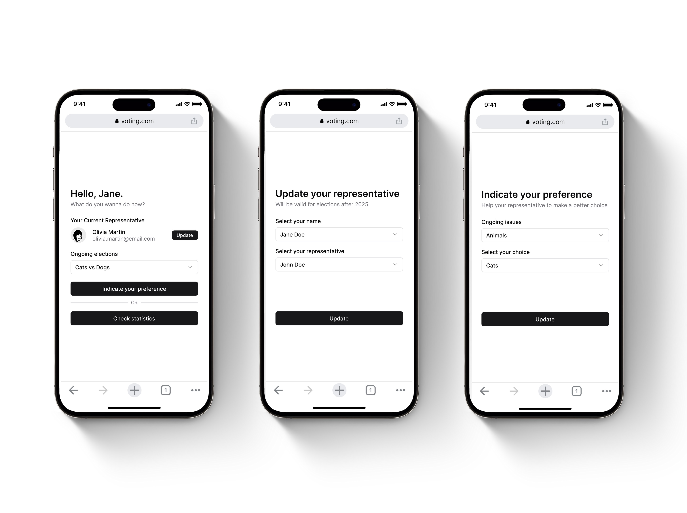

# Voting App
An application where users can select representatives, create issues, and view statistics. Users can add representatives with a unique email address, and the app tracks how many votes each representative has received. Additionally, users can create issues, although voting on them is not yet supported. Below, you can find images of the original design plan created in Figma, showcasing the envisioned structure and user interface of the app. The project emphasizes simplicity, dynamic updates, and a responsive design for accessibility across devices.

## Design in Figma

### Features: 
* **Add Representative**
  * Minimum of 1 representative
  * Input name
  * Input email
 

* **Create Election**
  * Input election name
  * Minimum of 2 choices
 

* **Create Public Vote and Vote**
  * Input Name 
  * List of representatives
  * Vote on representative 
  * List of ongoing elections
  * Indicate preferences in ongoing elections 
 

* **Representative Voting**
  * Number of public votes 
  * Public votes' preferences percentage per election
  * List of ongoing elections
  * Vote on a choice
 

* **Count Votes**
  * Calculate winner
  * Calculate public votes preferences percentages
  * Compute representative's votes
  * Calculate agreement rate
 

## Tables

* Election
Id | Created | Ended 
 

* Public Votes
Id | Name | Preference | Vote (Representative_Id) 
 

* Representatives
Id | Name | Email | Vote (Choice_Id) 
 

* Choices
Id | Name |  Election_Id 
 